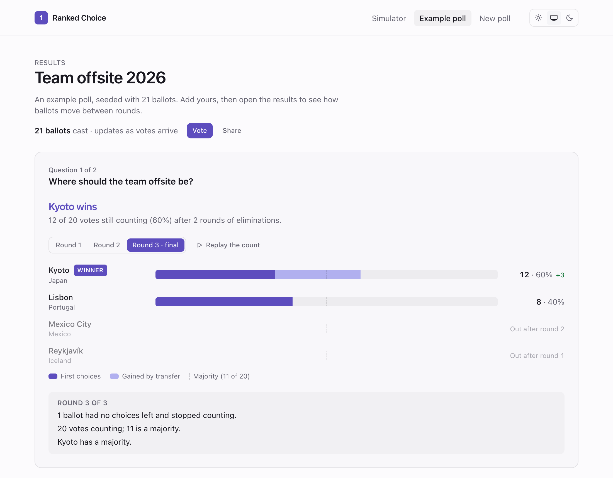
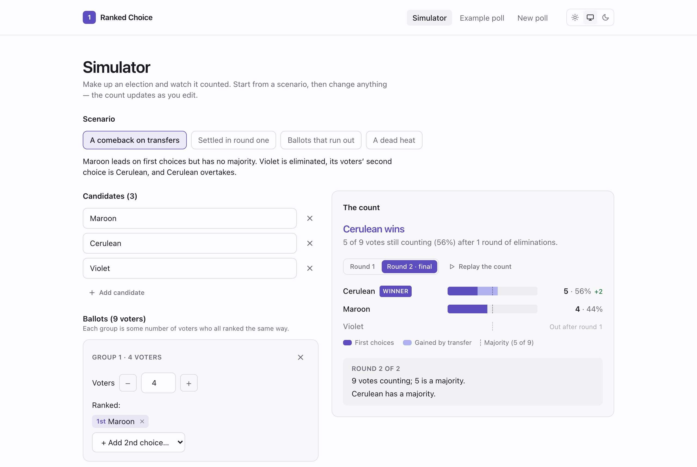
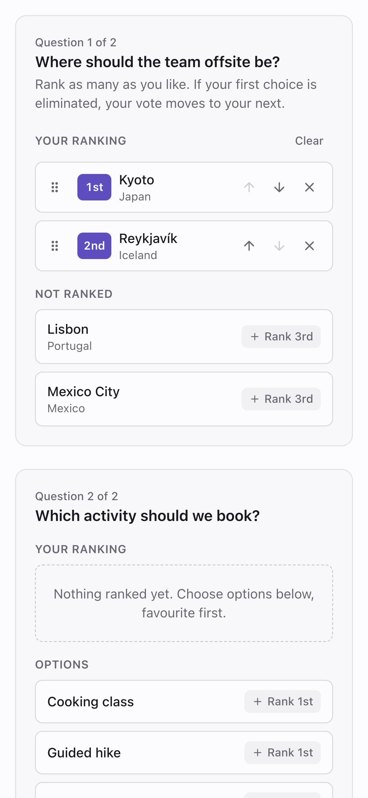
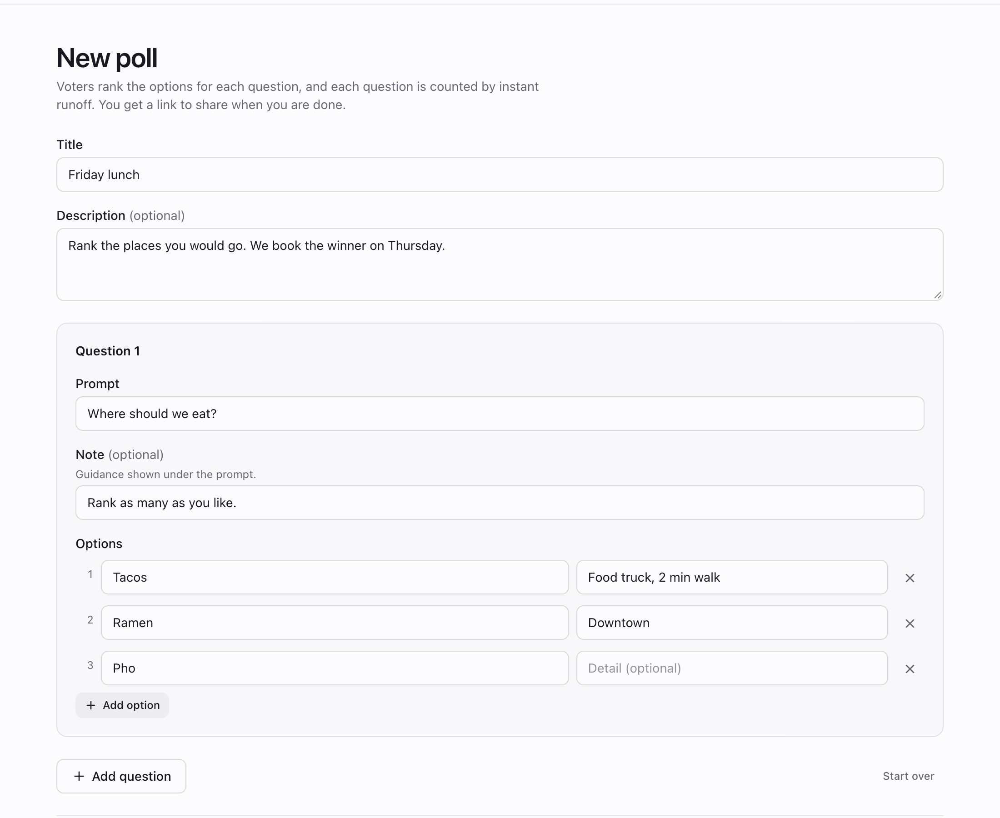

# Ranked Choice

[](https://github.com/nickjmorrow/ranked-choice/actions/workflows/ci.yml)

Polls you answer by ranking, counted by instant runoff — and a results page
that shows the count happen, round by round, instead of only announcing who
won.

**Live demo: [ranked-choice.204-168-227-216.sslip.io](https://ranked-choice.204-168-227-216.sslip.io)** —
open [the example poll's results](https://ranked-choice.204-168-227-216.sslip.io/polls/example/results)
and press *Replay the count* to watch Kyoto overtake Lisbon on transferred
votes. No sign-in. The example poll resets every night; polls you create are
kept for 30 days.

<picture>
  <source media="(prefers-color-scheme: dark)" srcset="docs/screenshots/results-dark.png">
  
</picture>

A ranked ballot lets you vote for your favourite without wasting your vote: if
it cannot win, your ballot moves to your next choice. That is easy to say and
hard to trust, so every question's results here are the whole count — the
votes each option had in each round, which were first choices and which
arrived by transfer, who was eliminated and why, and how many ballots ran out
of choices along the way.

Three ways in:

- **[Vote on the example poll](https://ranked-choice.204-168-227-216.sslip.io/polls/example)**,
  then see where your ballot went.
- **[The simulator](https://ranked-choice.204-168-227-216.sslip.io/simulator)** —
  make up the ballots and watch the count change as you edit. Four scenarios
  to start from: a comeback on transfers, a first-round majority, ballots that
  run out, and a dead heat.
- **[Create a poll](https://ranked-choice.204-168-227-216.sslip.io/polls/new)**
  and share one link.

Postgres + NestJS + React, three containers, one command. First written in
2020; rebuilt in 2026 — see [History](#history).
[AGENTS.md](./AGENTS.md) has the conventions and the reasoning behind them.

## Design decisions and trade-offs

- **The count is a pure function with one implementation, on the server.**
  `backend/src/tally/tally.ts` takes option ids and weighted ballots and
  returns every round; it imports nothing from Nest or the database. The
  simulator calls it through `POST /api/tally` rather than counting in the
  browser, so the simulator and a real poll can never disagree about the
  rules. *Trade-off:* the simulator needs the API up, and makes a request per
  (debounced) edit. [More](./AGENTS.md#the-counting-rules)
- **Results are the rounds, not the winner.** The API returns each round's
  counts, eliminations and exhausted ballots; the frontend splits every bar
  into first choices and transfers, draws the majority line, and narrates each
  round in a sentence. *Trade-off:* a bigger response and a view model
  (`frontend/src/rounds.ts`) to keep in step with the count's rules.
- **Two simplifications, stated rather than hidden.** Options tied for last are
  eliminated together, and a count where every remaining option is level stops
  as a tie. Real elections break those ties by lot or by earlier rounds; a
  poll app would have to pick one and explain it. *Trade-off:* the rare poll
  that ties for last eliminates more than one option in a round — and says so.
- **No accounts, on purpose.** Anyone can create a poll or vote, and a poll is
  addressed by an unguessable ten-character link. The cost is controlled
  instead: per-IP rate limits on the endpoints that write, strict validation
  of every id against the poll it claims to belong to, and on the public demo
  a nightly tidy-up: the example poll goes back to its seeded ballots, and
  visitors' polls are deleted after 30 days — long enough to share and use,
  and said on the page when you create one. *Trade-off:* nothing stops
  someone voting twice. The ballot
  page says so when this browser has voted before; it does not pretend to
  enforce it.
- **Accessibility is part of the definition of done.** Every drag has a button
  equivalent, focus is managed when a control removes itself, ranking changes
  and round narration are announced, and the results chart is text with
  decorative bars. [The rules](./AGENTS.md#accessibility)
- **Architecture rules are tests.** `frontend/src/structure.test.ts` fails the
  build on a literal palette colour, a component file not named after its
  export, or a pure module without a test. The backend's end-to-end suite
  runs every migration against a real Postgres, and asserts the rate limit.

## Screenshots

<table>
  <tr>
    <td width="68%"></td>
    <td width="32%"></td>
  </tr>
  <tr>
    <td>The simulator. Change a candidate or a ballot group and the count
    updates; each scenario says what to look for.</td>
    <td>Ranking on a phone: tap to rank, drag or use the arrows to reorder.</td>
  </tr>
  <tr>
    <td colspan="2"></td>
  </tr>
  <tr>
    <td colspan="2">Creating a poll. The draft is kept in the browser as you
    type; problems are listed at the top and beside each field.</td>
  </tr>
</table>

## Quick start

Needs Docker.

```bash
docker compose up
```

Then open <http://localhost:3002>. The migrate container creates the schema
and the example poll on the way up; source is mounted into the app containers,
so edits reload without a rebuild.

| Service | URL |
| --- | --- |
| Frontend | <http://localhost:3002> |
| API | <http://localhost:8002/api/health> |
| Postgres | `localhost:5435` (`app` / `app` / `app`) |

For the checks and the pre-commit hook, which run on the host:

```bash
scripts/setup.sh           # once per clone: dependencies and the git hook (needs Node 24)
scripts/check.sh           # lint, format, types, tests and builds, both halves
scripts/check.sh --fast    # the subset the hook runs — no database, no builds
```

The backend's end-to-end suite creates and drops its own database on the
Postgres that `docker compose up db -d` publishes.

## API

| Method | Path | |
| --- | --- | --- |
| `POST` | `/api/polls` | Create a poll; returns its `link` |
| `GET` | `/api/polls/:link` | Questions and options |
| `POST` | `/api/polls/:link/ballots` | Cast a ballot: a ranking of option ids per question |
| `GET` | `/api/polls/:link/results` | Every question's count, round by round |
| `POST` | `/api/tally` | Count hypothetical ballots — the simulator. Stores nothing |
| `GET` | `/api/meta` | On the public demo, how long a new poll is kept |
| `GET` | `/api/health` | Up if the database answers |

## Stack

| Layer | Choice |
| --- | --- |
| Database | Postgres 17 |
| Backend | NestJS 12, TypeORM 1, class-validator, `@nestjs/throttler` |
| Migrations | TypeORM, run by a one-shot container before the API starts |
| Frontend | React 19, Vite 8, TypeScript 6, Tailwind v4, TanStack Query, React Router, dnd-kit |
| Node deps | pnpm, pinned through `packageManager` and corepack |
| Tests | Jest (backend unit and end-to-end, against real Postgres), Vitest (frontend) |
| Lint | typescript-eslint strict type-checked, both halves; unicorn and jsx-a11y on the frontend |
| CI | GitHub Actions, running the same `scripts/check.sh` as the pre-commit hook |
| Hosting | One Ubuntu server: Docker Compose behind Caddy, via `scripts/deploy.sh` |

## Deploying it

```bash
scripts/deploy.sh root@203.0.113.5 ranked-choice.203-0-113-5.sslip.io
```

One server over SSH, safe to re-run. It installs Docker and Caddy, writes a
`.env.prod` with a generated database password, builds and starts the
production stack, puts Caddy in front for HTTPS, and installs the nightly demo
tidy-up. nginx is published on `127.0.0.1` only — on `0.0.0.0` the plain-HTTP
port would be reachable past the firewall, because Docker writes its own
iptables rules. It is the same script as
[clinical-copilot](https://github.com/nickjmorrow/clinical-copilot)'s and
[payout-ledger](https://github.com/nickjmorrow/payout-ledger)'s, and shares a
server with them.

By hand, on any host with Docker Compose:

```bash
cp .env.prod.example .env.prod          # set POSTGRES_PASSWORD
docker compose -f docker-compose.prod.yml --env-file .env.prod up --build -d
```

| | Development | Production |
| --- | --- | --- |
| Frontend | Vite dev server | Built bundle on nginx, which also proxies `/api` |
| Reload | Hot, with source mounts | None; the image is the artifact |
| Backend user | root | The image's unprivileged `node` user |
| Postgres port | Published on 5435 | Not published at all |
| Logs | Human-readable | JSON |
| Headers | — | Strict CSP, nosniff, frame-deny, gzip |

## Project layout

```
backend/src/tally/       The counting rules, as a pure function, and its tests
backend/src/polls/       Polls, questions, options, ballots: entities, DTOs, views
backend/src/migrations/  The schema's history, 2020 onwards, and the example poll
backend/test/            End-to-end tests against a real Postgres
frontend/src/            Pure view-model modules (rounds, scenarios, pollForm…)
frontend/src/components/ One component per file
frontend/src/pages/      One component per route
scripts/                 setup.sh, check.sh, deploy.sh, reset-demo.sh
docs/                    Screenshots, and the 2020 requirements notes
AGENTS.md                The conventions, and the reasoning
```

## What's deliberately not here

- **Voter identity.** One ballot per person needs accounts, invite tokens or
  at least a cookie with teeth; each is a product decision as much as a
  technical one. The seam is `castBallot` in `backend/src/polls/polls.service.ts`.
- **Editing a poll after creation.** Changing options under ballots already
  cast changes what those ballots meant. A poll is closed to edits instead.
- **Optional questions.** The schema has `is_required` and the API enforces it,
  but the create form makes every question required; the UI to choose is small
  and has not been needed.
- **Real-time results.** The results page refetches every fifteen seconds. A
  push channel would be more machinery than a poll of this size needs.

## History

The 2020 version was React 16 with Redux-Saga and a personal component library,
NestJS 7 and TypeORM 0.2 on Node 10, built by CircleCI and deployed to Netlify
and Heroku's free tier — which no longer exists. The 2026 rebuild kept the
idea, the NestJS backend and the counting algorithm's tests, and:

- rebuilt the frontend on the stack above, with a theme picker, accessible
  ranking, a results page that narrates each round, and a simulator built on
  ballot groups instead of one card per voter;
- fixed three bugs the old version shipped with: ballots cast at the same
  moment could be merged into one (their ids were `max + 1`); on a fresh
  database the first poll created collided with the seed data's ids; and a
  ballot naming another poll's option was stored, and broke that question's
  results for everyone;
- added validation, rate limiting, transactions, a health check and
  end-to-end tests; and
- moved hosting to the same one-server Docker and Caddy setup as the author's
  other projects, with CI on GitHub Actions.

The original requirements notes are in
[docs/original-requirements/](./docs/original-requirements/).
